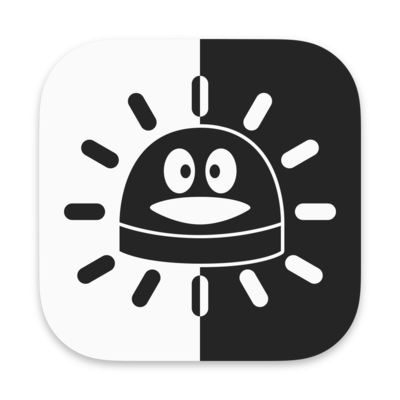

# 

<h1 align="center">DimQQ</h1>
<h3 align="center">一款可自定义强度的QQ for Mac亮度降低工具</h3> 

## 运行截图
  

## 使用
DimQQ启动后会在菜单栏显示一个图标, 点击图标可对遮罩浓度强度调整.  
使用QQ时, DimQQ会自动生成一个覆盖在QQ窗口上层的遮罩层, 以此来降低QQ窗口的亮度.  

## 常见问题
**1. 为什么DimQQ启动后没有任何窗口?**  
> DimQQ除了菜单栏图标外, 仅会在QQ运行时生成遮罩. 除此之外没有其他额外的窗口.  

**2. 为什么打开DimQQ之后QQ没有变暗?**  
> 可能因为启动DimQQ时, QQ处于非活动状态. 只需要点击一下QQ的窗体, DimQQ就会立即生成遮罩.  

**3. 使用的过程中可以移动QQ窗口吗, 打开多个QQ聊天窗口也可以吗?**  
> 可以, 使用过程中DimQQ会动态检测QQ的窗口区域信息, 并实时调整遮罩尺寸和位置.  
> 多窗口情况则会生成一个足以覆盖所有QQ窗口的遮罩.  

**4. 支持多显示器使用场景吗?**  
> 支持. 使用过程中可以任意移动QQ窗口到任何一台显示器上. 遮罩层都会自动跟踪. 
