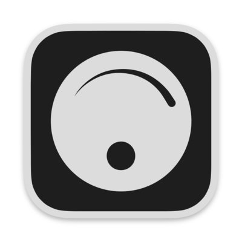

# 
<p align="center">

<h1 align="center">AppDimmer</h1>
<h3 align="center">一款用于 macOS 的软件窗口亮度控制工具</h3> 
</p>

## 运行截图
<p align="center">
  
</p>

## 安装与使用
### 安装:
可[点此前往](../../releases)下载最新版安装文件. 或使用homebrew安装:  
```bash
brew install lihaoyun6/tap/appdimmer
```
### 使用:
AppDimmer启动后会在菜单栏显示图标, 点击图标并拖动滑块可对遮罩强度进行调整.  
您可以通过右键单击AppDimmer的菜单栏图标来关闭或启用AppDimmer.  
也可以左键点击菜单栏图标再点击应用名来对某个App设置启用或停用亮度控制.  

## 常见问题
**1. 为什么AppDimmer启动后没有任何窗口?**  
> AppDimmer除了菜单栏图标外, 仅会在您指定的App运行时生成遮罩. 除此之外没有其他额外的窗口.  

**2. 启用AppDimmer后依旧无法覆盖某些App窗口怎么办?**  
> 可以点击AppDimmer的菜单栏图标, 并尝试禁用"窗口筛选器"功能.  

**3. 感觉默认的遮罩强度太黑或不够黑怎么办?**
> 可以点击AppDimmer的菜单栏图标, 并拖动滑块以调节遮罩强度至您认为合适的比例.  

**4. 启用遮罩后效果依旧不佳怎么办?**
> 可以点击AppDimmer的菜单栏图标, 并启用"反转颜色"功能. 此模式下, AppDimmer将会在保持图像元素色调不变的情况进行明暗反转.  

**5. 启用反色模式后窗口动画变卡怎么办?**
> 可以点击AppDimmer的菜单栏图标, 并在`偏好设置...` > `刷新率...`选项中选取更高的刷新率. 但更高的刷新率也将占用更多的CPU算力, 请自行衡量.  

**6. 使用的过程中可以移动App窗口吗, 支持多个App同时运行吗?**  
> 可以. 使用过程中AppDimmer会动态检测所有指定App窗口位置和尺寸, 并为每个App的每个窗口实时生成遮罩.  

**7. 支持在多台显示器间移动窗口吗?**  
> 支持. 使用过程中可以任意移动程序窗口到任何一台显示器上. 遮罩会自动跟踪. 

## 致谢
[AXSwift](https://github.com/tmandry/AXSwift) @tmandry  

## 赞助

